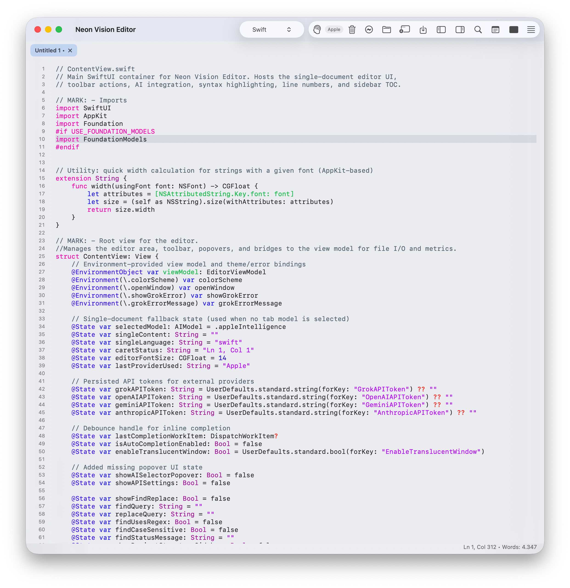

<h1 align="center">Neon Vision Editor</h1>

<p align="center">
  
</p>

<h4 align="center">
  A lightweight, modern editor focused on speed, readability, and automatic syntax highlighting.
</h4>

<p align="center">
  Minimal by design: quick edits, fast file access, no IDE bloat.
</p>

<p align="center">
  Release Download: <a href="https://github.com/h3pdesign/Neon-Vision-Editor/releases">GitHub Releases</a>
</p>

> Status: **active release**  
> Latest release: **v0.4.5**  
> Platform target: **macOS 26 (Tahoe)** compatible with **macOS Sequoia**
> Apple Silicon: tested / Intel: not tested

## Download

Prebuilt binaries are available on [GitHub Releases](https://github.com/h3pdesign/Neon-Vision-Editor/releases).

- Latest release: **v0.4.6**
- Architecture: Apple Silicon (Intel not tested)
- Notarization: *is finally there*

## Getting Started (30 Seconds)

1. Install using `curl` or Homebrew (below), or download the latest `.zip`/`.dmg` from [Releases](https://github.com/h3pdesign/Neon-Vision-Editor/releases).
2. Move `Neon Vision Editor.app` to `/Applications`.
3. Launch the app.
4. Open a file with `Cmd+O`.
5. Use `Cmd+P` for Quick Open and `Cmd+F` for Find & Replace.
6. Toggle Vim mode with `Cmd+Shift+V` if needed.

## Install

### Quick install (curl)

Install the latest release directly:

```bash
curl -fsSL https://raw.githubusercontent.com/h3pdesign/Neon-Vision-Editor/main/scripts/install.sh | sh
```

Install without admin password prompts (user-local app folder):

```bash
curl -fsSL https://raw.githubusercontent.com/h3pdesign/Neon-Vision-Editor/main/scripts/install.sh | sh -s -- --appdir "$HOME/Applications"
```

### Homebrew

```bash
brew tap h3pdesign/tap
brew install --cask neon-vision-editor
```

Tap repository: [h3pdesign/homebrew-tap](https://github.com/h3pdesign/homebrew-tap)

If Homebrew asks for an admin password, it is usually because casks install into `/Applications`.
Use this to avoid that:

```bash
brew install --cask --appdir="$HOME/Applications" neon-vision-editor
```

### Gatekeeper (macOS 26 Tahoe)

If macOS blocks first launch:

1. Open **System Settings**.
2. Go to **Privacy & Security**.
3. In **Security**, find the blocked app message.
4. Click **Open Anyway**.
5. Confirm the dialog.

## Features

- Fast loading for regular and large text files.
- Tabbed editing with per-file language support.
- Automatic syntax highlighting for many languages and formats.
- Optional support purchase flow (StoreKit 2) in Settings. **(NEW in v0.4.5)**
- Cross-platform theme settings panel with improved settings organization. **(NEW in v0.4.5)**
- Inline code completion with Tab-to-accept ghost suggestions.
- Starter templates for all languages with one-click insert.
- Document-type handling for `.plist`, `.sh`, and general text so Finder/iOS can route those files straight into the editor.
- Toolbar Map card in the welcome tour now scales to fill a taller inner frame, keeping the button cards inside the border.
- Regex Find/Replace with Replace All.
- Project tree sidebar plus Quick Open (`Cmd+P`).
- Optional Vim mode (basic normal/insert workflow).
- Multi-window workflow with focused-window commands.
- Native Swift/AppKit editor experience.
- No telemetry.

<p align="left">
  
</p>

## Keyboard Shortcuts

| Shortcut | Action |
|---|---|
| `Cmd+N` | New Window |
| `Cmd+T` | New Tab |
| `Cmd+O` | Open File |
| `Cmd+S` | Save |
| `Cmd+W` | Close Tab |
| `Cmd+P` | Quick Open |
| `Cmd+F` | Find & Replace |
| `Cmd+Shift+V` | Toggle Vim Mode |
| `Cmd+Option+S` | Toggle Sidebar |
| `Cmd+Option+L` | Toggle Line Wrap |
| `Cmd+Shift+D` | Toggle Brain Dump Mode |
| `Tab` | Accept code completion (when shown) |

## Changelog

### v0.4.6 (summary)

- TODO
- TODO
- TODO

### v0.4.5 (summary)

- Optional support purchase flow (StoreKit 2) with a dedicated Settings -> Support tab.
- Local StoreKit testing file (`SupportOptional.storekit`) and App Store review notes (`docs/AppStoreReviewNotes.md`).
- New cross-platform theme settings panel and iOS app icon asset catalog set.
- Settings architecture cleanup: editor options consolidated into Settings dialog/sheet and aligned with toolbar actions.
- Language detection and syntax highlighting stability for newly opened tabs and ongoing edits.

### v0.4.4-beta (summary)

- Added inline code completion ghost text with Tab-to-accept behavior.
- Added starter templates for all languages and a toolbar insert button.
- Improved language detection and mapping, including C and C# recognition.
- Updated welcome tour with release highlights and a full toolbar/shortcut guide.
- Added language detection tests and a standalone test target.

### v0.4.3-beta (summary)

- Added syntax highlighting for **COBOL**, **Dotenv**, **Proto**, **GraphQL**, **reStructuredText**, and **Nginx**.
- Added extension and dotfile mapping for `.cob`, `.cbl`, `.cobol`, `.env*`, `.proto`, `.graphql`, `.gql`, `.rst`, and `.conf`.
- Added language picker entries for the new languages across toolbar and command menus.
- Added sample fixtures for manual verification of new language detection and highlighting.
- Finder/Open With now opens files in the active window when available.
- Added macOS document-type registration for supported extensions.

### v0.4.2-beta (summary)

- Fixed toolbar/menu actions to target the active window only.
- Fixed multi-window command routing to use the focused window model.
- Unified persistence behavior for Brain Dump and translucent window toggles.
- Removed duplicate `Cmd+F` binding conflict in toolbar wiring.
- Added syntax highlighting support for `vim`, `log`, and `ipynb`.
- Added extension-based auto-detection for `.vim`, `.log`, `.ipynb`, and `.vimrc`.

### v0.4.1-beta (summary)

- App Store security and distribution readiness updates.
- Added release/distribution documentation and checklist updates.

Full release history: [`CHANGELOG.md`](CHANGELOG.md)

## Known Limitations

- Intel Macs are not fully validated.
- Vim support is intentionally basic (not full Vim emulation).
- iOS/iPad editor functionality is still more limited than macOS.

## Privacy & Security

- Privacy policy: [`PRIVACY.md`](PRIVACY.md).
- API keys are stored in Keychain (`SecureTokenStore`), not `UserDefaults`.
- Network traffic uses HTTPS.
- No telemetry.
- External AI requests only occur when code completion is enabled and a provider is selected.
- Security policy and reporting details: [`SECURITY.md`](SECURITY.md).

## Release Integrity

- Tag: `v0.4.6`
- Tagged commit: `TBD`
- Verify local tag target:

```bash
git rev-parse --verify v0.4.6
```

- Verify downloaded artifact checksum locally:

```bash
shasum -a 256 <downloaded-file>
```

## Requirements

- macOS 26 (Tahoe)
- Xcode compatible with macOS 26 toolchain
- Apple Silicon recommended

## Build from source

```bash
git clone https://github.com/h3pdesign/Neon-Vision-Editor.git
cd Neon-Vision-Editor
open "Neon Vision Editor.xcodeproj"
```

## Git hooks

To auto-increment Xcode `CURRENT_PROJECT_VERSION` on every commit:

```bash
scripts/install_git_hooks.sh
```

## Support

If you want to support development:

- [Patreon](https://www.patreon.com/h3p)
- [My site h3p.me](https://h3p.me/home)

## License

Neon Vision Editor is licensed under the MIT License.
See [`LICENSE`](LICENSE).
